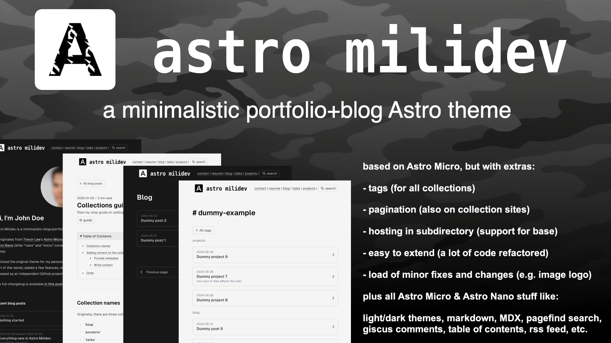

# Astro Milidev

  **[DEMO / LIVE PREVIEW](https://bartoszlenar.github.io/astro-milidev)**

## Info

Astro Milidev is a minimalistic portfolio+blog [Astro](https://astro.build) theme.

It originates from [Trevor Lee](https://github.com/trevortylerlee)'s [Astro Micro](https://astro-micro.vercel.app/) theme, which is based on [Mark Horn](https://github.com/markhorn-dev)'s [Astro Nano](https://astro-nano-demo.vercel.app/) (after "nano" and "micro" comes "mili", hence the first part of the name).

Astro Milidev enhances the above codebases with a variety of features. I customized the original theme for my personal website, [lenar.dev](https://lenar.dev/) (hence the second part of the name), and also refactored core parts of the code, making it more customizable and extensible. 

The changelog is available in this post: [Everything new in Astro Milidev](https://bartoszlenar.github.io/astro-milidev/blog/everything-new-in-astro-milidev/). Another post [Getting started](https://bartoszlenar.github.io/astro-milidev/blog/getting-started/) explains the configuration process step by step. The code is available on [GitHub](https://github.com/bartoszlenar/astro-milidev).

Enjoy!

## Contributions

Any PRs are more than welcome. Please direct them to the `develop` branch.

## License

MIT! 
